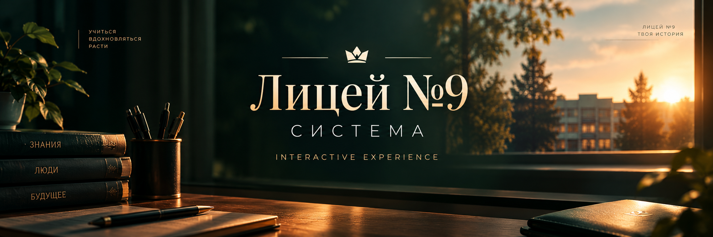

🎓✨ Лицей №9 — Система

> Интерактивная веб-история / квест с выбором роли, сценами и финальным сообщением.

🚀 О проекте

🎮 Интерактивное одностраничное приложение, где пользователь проходит историю из 5 сцен и получает персональный результат.

💡 Фокус проекта:

атмосфера школьного “кино”
эмоциональные переходы
лёгкая геймификация
визуальная подача как интерактивный фильм

🧭 Сценарий

🟢 Старт
⬇
👤 Выбор роли
⬇
📚 5 сцен-вопросов
⬇
🏁 Результат
⬇
💌 Финальное сообщение
⬇
🎬 Бонус-видео

🎮 Возможности

✨ Реализовано:

🖼️ динамические фоны без перезагрузки
🌫️ плавные переходы сцен (fade / crossfade)
🎭 выбор персонажа (роль пользователя)
❓ система вопросов с подсчётом результата
🏆 разные финальные состояния
💬 персонализированное сообщение
🎥 модальное окно с видео
🔊 звуковые эффекты и музыка
✨ визуальные эффекты (частицы, float-анимации)
🧱 Структура проекта
📁 project/
│
├── 📄 index.html
├── 📄 README.md
│
├── 🖼️ img/
│   ├── banner.png   ← ⭐ баннер
│   ├── start.jpg
│   ├── choose.jpg
│   ├── class.jpg
│   ├── hall.jpg
│   ├── library.jpg
│   ├── tech.jpg
│   ├── hall2.jpg
│   └── final.jpg
│
├── 🎬 video/
│   └── slideshow.mp4
│
├── 🎵 audio/
│   ├── music.mp3
│   ├── click.mp3
│   ├── whoosh.mp3
│   ├── voice.mp3
│   ├── class.mp3
│   ├── hall.mp3
│   ├── library.mp3
│   ├── tech.mp3
│   └── hall2.mp3
⚙️ Технологии

🧠 Без фреймворков:

HTML5
CSS3 (glassmorphism + gradients + animations)
Vanilla JavaScript
Canvas particles
Web Audio API
Fullscreen API
🌐 Деплой (GitHub Pages)

🌐 GitHub Pages

📌 Включение:

Settings → Pages → Deploy from branch
Branch: main
Folder: /root

⚠️ Ограничения GitHub

🚫 файл >100MB не загружается

📌 решения:

Яндекс.Диск
CDN
сжатие видео (H.264 baseline)

🎥 Видео
📁 Локально
video/slideshow.mp4
☁️ Внешний вариант
Яндекс.Диск (публичная ссылка)
облачный хостинг
прямой MP4 URL

💡 Архитектура

🖼️ Фон:

двойной буфер (bg / bg2)
preload изображений
плавная смена без мерцания
🔮 Возможные улучшения
💾 сохранение прогресса
🌳 ветвление сюжета
📊 аналитика прохождения
📱 PWA (установка на телефон)
☁️ backend (Firebase / Supabase)
👤 Автор

🎨 Проект создан как интерактивная образовательная система с элементами сторителлинга и визуального опыта.
https://gratati.github.io/school/ 

📌 Лицензия

📚 Для образовательных и демонстрационных целей
🔧 Разрешена модификация и адаптация
